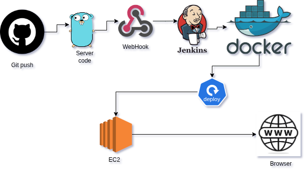

# CI/CD Pipeline Deployment to AWS EC2 Using GitHub Actions
Welcome to my personal project repository, where I demonstrate how I automate the deployment of backend services using GitHub Actions, Docker, and AWS EC2. This project showcases my ability to set up CI/CD pipelines, containerize applications, and deploy them to the cloud — reflecting my skills and experience in modern development workflows.

## 🖼️ Architecture Diagram


## 🛠️ Deployment Steps

### 1. CI Pipeline (GitHub Actions)
Created CI pipeleine.


Logs into DockerHub using credentials stored in GitHub Secrets:
- DOCKER_USERNAME
- DOCKER_PASSWORD
Push code to the main branch triggers the CI pipeline.
Builds a Docker image using the provided Dockerfile.
Tags and pushes the image to DockerHub repository: jackson216/cicd-pipeline.

### 2. CD Pipeline (GitHub Actions on EC2)

- GitHub self-hosted runner runs on AWS EC2.
- When CI completes:
  - Pulls latest Docker image from DockerHub.
  - Stops and removes old container (if exists).
  - Runs the updated container exposing port 8080

### 3. EC2

- EC2 Ubuntu 24.04 instance is used.
- Security group allows HTTP (port 80) ,HTTPS(443) SSH (22)
- Validate with:
  ```bash
  curl http://<your-ec2-ip>


  
# CI/CD Pipeline Deployment to AWS EC2 Using jenkin

This guide explains how to set up a complete CI/CD pipeline using Jenkins to deploy a Dockerized application to an AWS EC2 instance.

## 🖼️ Architecture Diagram



### 1.Install jenkin on ec2 t2.Medium instance .
  - after installation sucessful enter the password found in /var/lib/jenkins/secrets/initialAdminPassword.
  - create username and passoword
### 2. store github credentials and dockerhub credentials in jenkin credentials
- Navigate to: **Manage Jenkins → Credentials**
- Add:
  - **GitHub**: Use your username and personal access token.
  - **Docker Hub**: Use your Docker Hub username and password/access token.
 
  - 
### 3. create cicd pipeline 
 - stage 1: cloning repository
 - stage 2 :Build Docker Image
 - stage 3 :Login to Docker Hub
 - stage 4 :Push Docker Image
 - stage 5 :Deploy to EC2

### 4. 4. Enable GitHub Webhook for Automated Trigger
In your GitHub repository, go to:
Settings → Webhooks → Add Webhook

Fill in:

Payload URL:
http://<your-ec2-ip>:8080/github-webhook/

Content type:
application/json

Trigger:
Just the push event

In Jenkins, go to your job configuration:

Check ✅ GitHub hook trigger for GITScm polling

This setup ensures Jenkins automatically triggers a build and deployment whenever you push code to GitHub.
## ☁️ 5. EC2 Configuration

- **OS:** Ubuntu 24.04
- **Security Group Inbound Rules:**
  - **HTTP (80)**
  - **HTTPS (443)**
  - **SSH (22)**
  - **Custom TCP (8080)** – for Jenkins
  - **Custom TCP (8000/8081)** – for your application

